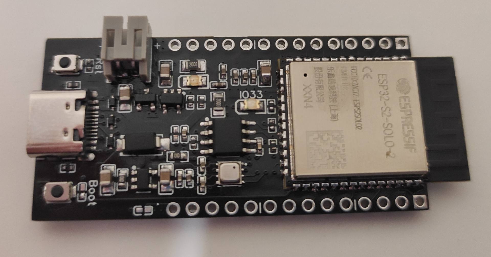
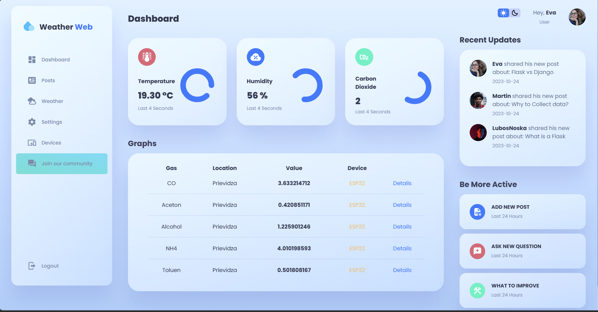
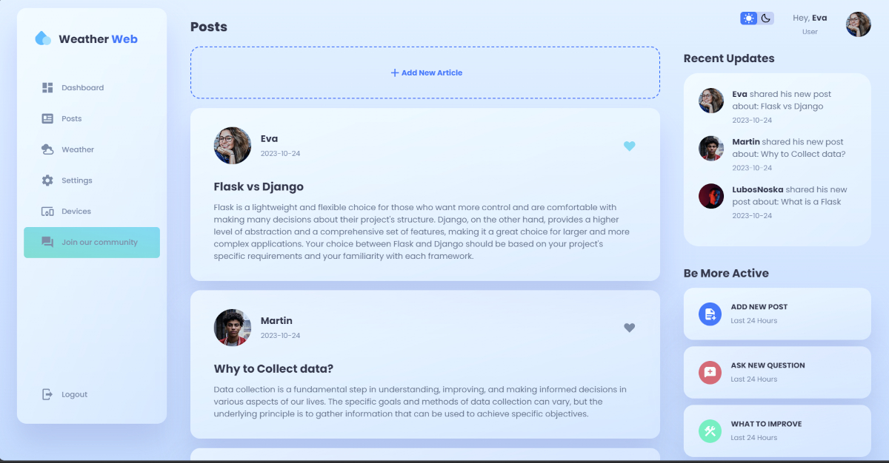
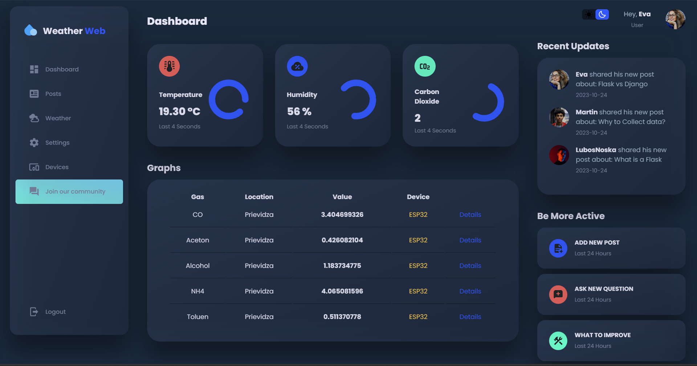
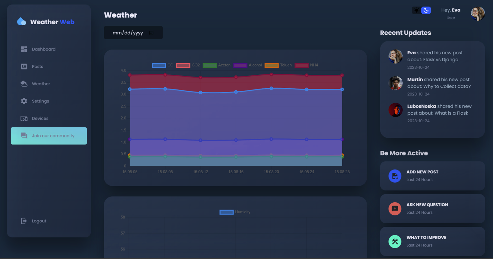

# ESP32 Weather-station and Website

  

## Overview:
Hey there! I'm a passionate student developer, and I want to share my exciting project with you. I've built an ESP32-based weather station. It collects crucial environmental data like **temperature, humidity, CO, CO2, and more**, and securely stores it in a database. But here's the cool part: this data is then beautifully displayed on my website, which runs on a Raspberry Pi 3B+.

## Features:
- **Data Collection**: My weather station does some heavy lifting by collecting real-time data. It's like having your own mini-meteorologist.

- **Web Interface**: I've created a user-friendly website that allows you to log in, create, delete, update, and like posts. Plus, you can view all the data in nifty charts, tailored to specific days.

- **Day or Night**: I'm all about choices. You can switch between dark and light modes on the website, depending on your mood or lighting conditions.

- **Device Compatibility**: No matter if you're using your trusty desktop or your handy smartphone, my website is fully responsive. I want you to access your data anytime, anywhere.

## My ESP32 board:
I designed my ESP32-S2 board with some impressive upgrades:

- **Battery Connection**: Because we don't want power interruptions to mess with our data.

- **SD Card Slot**: Data loss? Not on my watch. An SD card will keep everything safe.

- **RTC (Real-Time Clock):** To keep track of the precise time and date for each data point.

- **Built-In Sensor**: The new ESP32-S2 will monitor temperature, humidity, and more right out of the box. 

It's all about making things easier.

Stay tuned for updates and, if you're as excited as I am, consider giving it a star on GitHub to show your support. Let's make weather data cool and accessible! 💡🌦️

## Website
### Light Mode

Monitors and displays the current carbon monoxide levels.

Engage with the community by liking posts shared by others.

### Dark Mode

Visualize different weather parameters over time with dynamic charts.

## My display

I used my ESP32-S2 board with TFT display from Aliexpress and put together this device. It shows current time, date and forecast data. 

    

## Server

- **OS**: Ubuntu 22.04 LTS

Website and MQTT broker runs on Raspberry pi 3b+

    

---

### Contact Me

Lubos Noska - <a>lubos.noska12@gmail.com</a>

